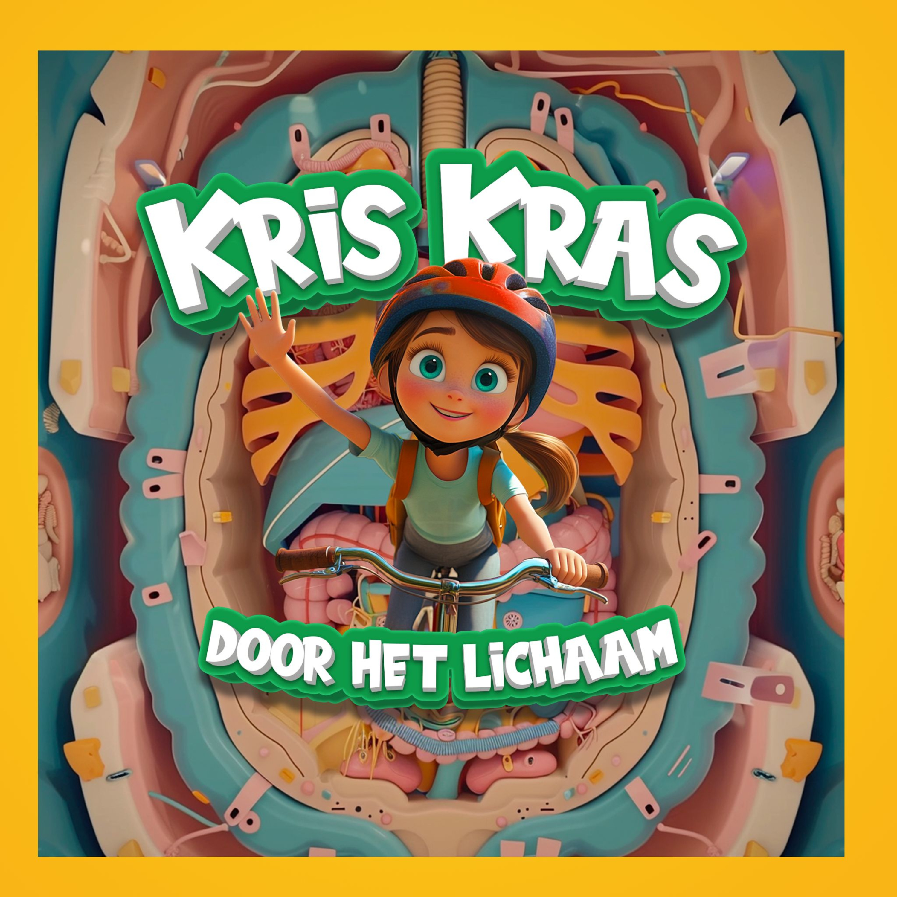

# Kris Kras - Door het Lichaam 

Kris is een meisje van bijna 7 jaar en Annemiek is haar moeder. Kris heeft veel vragen en Annemiek is al jaren arts. Laat dat nou een leuke combinatie zijn voor een luchtige educatieve podcast, speciaal voor kinderen, over het menselijk lichaam en medische onderwerpen. Elke aflevering wordt er een nieuw onderwerp besproken. We gaan Kris Kras door het hele lichaam: ga je mee?

## Trailer - 000

<audio controls>
  <source src="{{ '/assets/audio/kris_kras - door het lichaam - 000.wav' | relative_url }}" type="audio/wav">
  Your browser does not support the audio element.
</audio>

### Test sub

## Longen - 001

## Hart - 002

## Hersenen - 003

